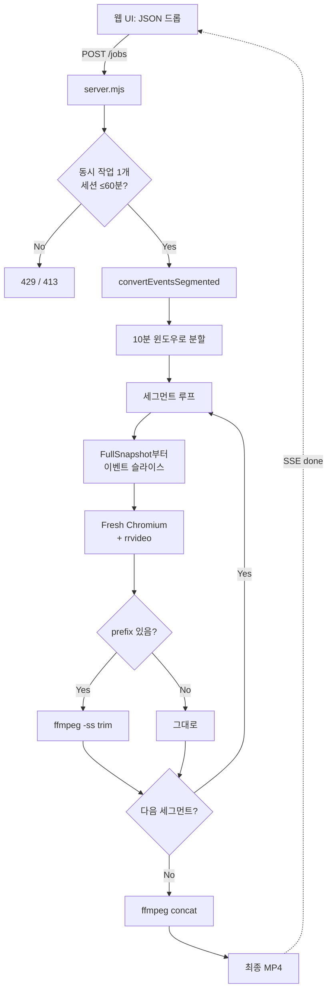
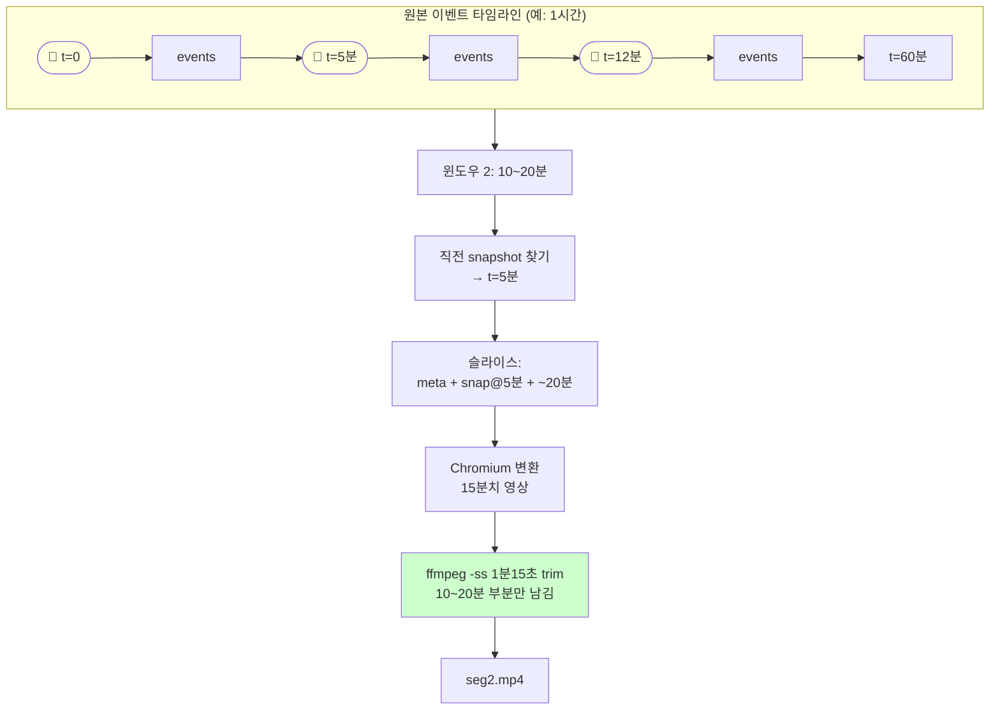

# rrweb-to-mp4

Sentry replay JSON(rrweb) → MP4 변환기. 백엔드는 Sentry 팀 공식 도구인
[`@rrweb/rrvideo`](https://www.npmjs.com/package/@rrweb/rrvideo)
(Playwright + rrweb 기반)을 그대로 사용. 위에 드래그앤드롭 웹 UI만 얹은 형태.

## 설치

```powershell
npm install
```

`@rrweb/rrvideo`가 Playwright를 끌어오고, `postinstall` 훅이 Chromium(~150MB)을 자동으로 받습니다.

## 1. 웹 UI

```powershell
npm start
```

브라우저로 [http://localhost:3000](http://localhost:3000) → JSON 드롭 → 자동 변환·다운로드.

옵션:
- **비디오 재생 속도** (1x ~ 16x) — 결과 MP4가 몇 배속으로 재생될지. 변환 시간도 같이 줄어듦.
- **해상도** (50% / 75% / 100%)


옵션:

| 옵션 | 기본 | 설명 |
|------|------|------|
| `--speed N` | 4 | 비디오 재생 속도 (= rrweb 내부 재생 배속) |
| `--scale N` | 0.75 | 해상도 배율 (0.25 ~ 1) |

```powershell
node convert.mjs replay.json out.mp4 --speed 1 --scale 1
```

## 변환 시간 (1시간 세션 기준)

배속 = 결과 MP4 재생 속도이자 변환 시 rrweb 재생 속도. 둘은 같이 움직임 — 4x로 변환하면 결과도 4배속.

| 옵션 | 변환 시간 | 결과 길이 |
|------|-----------|-----------|
| `--speed 1` | 약 1시간 | 1시간 |
| `--speed 2` | 약 30분 | 30분 |
| `--speed 4` (기본) | 약 15분 | 15분 |
| `--speed 8` | 약 7분 | 7분 |
| `--speed 16` | 약 4분 | 4분 |

`@rrweb/rrvideo`는 Playwright 내장 video recording을 사용해 세션 길이만큼 실제로 재생하면서 녹화합니다. 따라서 1x 부드러운 변환은 본질적으로 세션 길이만큼 시간이 듭니다 (rrvideo든, 다른 어떤 헤드리스 도구든 동일).

## 동작 방식

### 전체 변환 파이프라인



### 세그먼트 슬라이싱 (왜 trim이 필요한가)

각 윈도우는 rrweb 재생을 위해 직전의 `FullSnapshot(type=2)`부터 이벤트를 포함시켜야 합니다.
그래서 변환된 영상 앞쪽에 윈도우 밖의 prefix가 붙고, 이걸 `ffmpeg -ss`로 잘라낸 뒤 concat합니다.



세그먼트마다 **Chromium이 완전히 재시작**되므로 메모리는 한 윈도우 분량으로 한정됩니다. 덕분에 1GB RAM 환경(Railway Trial 등)에서도 긴 세션이 가능합니다.

## 파일 구조

```
core.mjs        # convertEvents (단일) + convertEventsSegmented (세그먼트)
server.mjs      # Express 서버 + SSE 진행률 + 가드
convert.mjs     # CLI 진입점
Dockerfile      # Playwright 1.60 + ffmpeg (Railway 배포용)
public/
  └── index.html  # 드롭존 + 컨트롤 + 진행률 UI
```

## 문제 해결

- **`postinstall`에서 Chromium 다운로드 실패** → 수동 실행: `npx playwright install chromium`
- **포트 3000 충돌** → `set PORT=4000 && npm start`
- **빈 영역/깨진 폰트** → 원본 페이지의 CORS 차단 리소스. rrweb 한계.
- **메모리 부족** → `node --max-old-space-size=8192 server.mjs`
